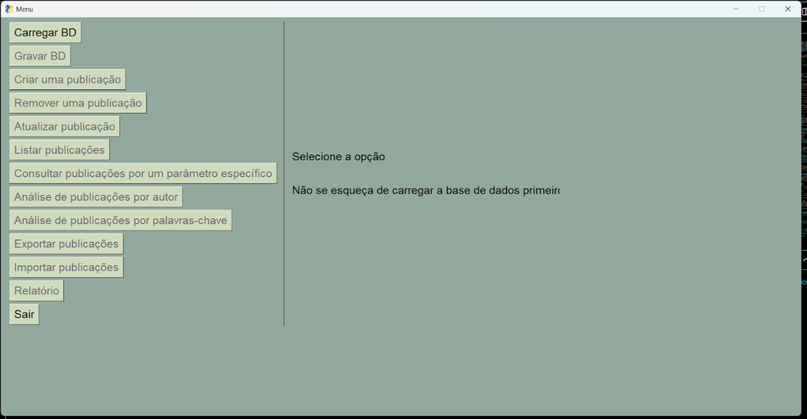
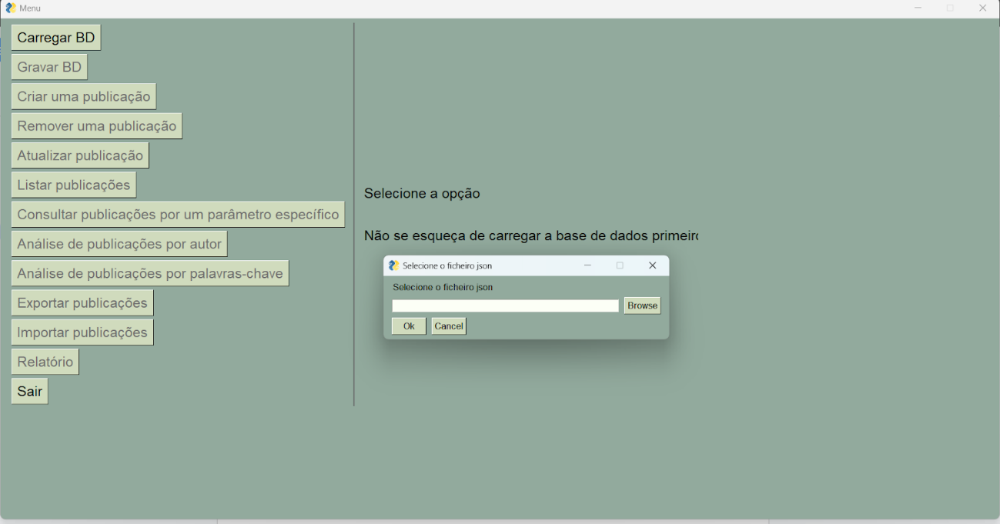
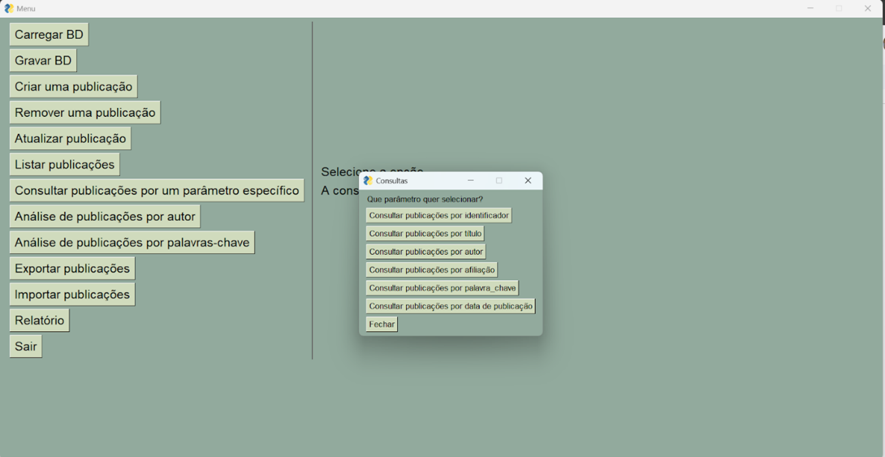
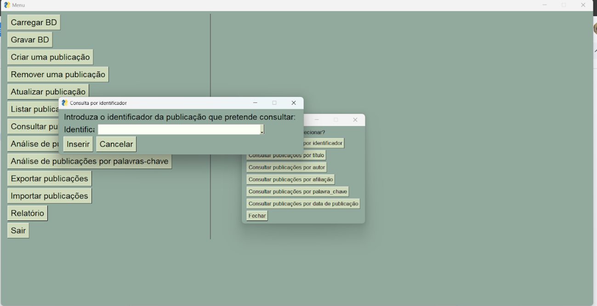
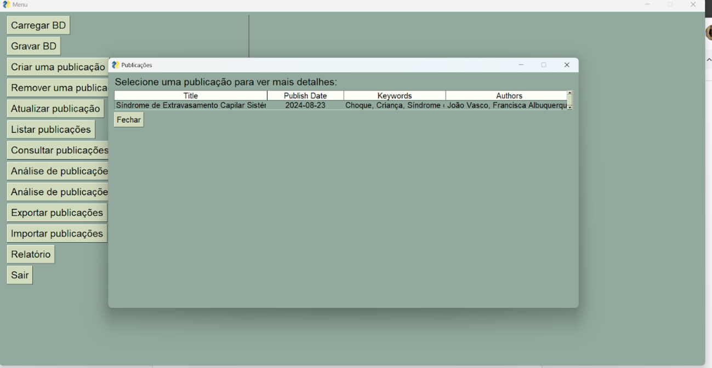
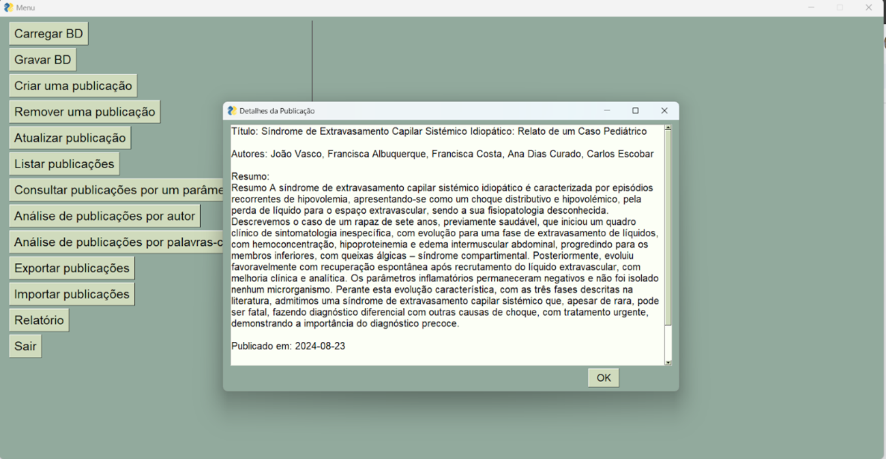
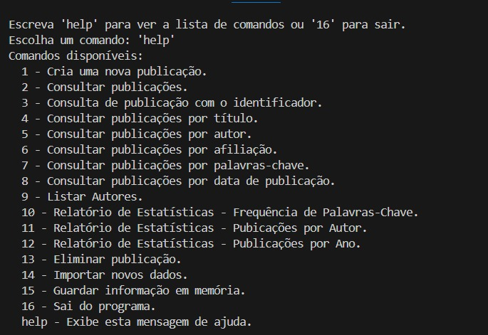

  
**Universidade do Minho**   
Escola de Engenharia 

Carolina Silva, A101471  
Francisca Mendes, A103833  
Sílvia Gonçalves, A103921

# **Sistema em Python para criação, atualização e análise de publicações científicas**

Relatório  
Licenciatura em Engenharia Biomédica   
Algoritmos e Técnicas de Programação  
1º Semestre, Ano Letivo 2024/2025

**Docentes da Unidade Curricular:**  
Professor José Carlos Ramalho  
Professora Luís Filipe Cunha

*Braga, Janeiro de 2025*

## **Resumo**:
Neste relatório é documentado o desenvolvimento de um programa que permite a consulta e análise de publicações científicas, elaborado no âmbito da unidade curricular Algoritmos e Técnicas de Programação. A aplicação foi elaborada com recurso à linguagem python e oferece diversas funcionalidades, como criação de novas publicações, a sua atualização, a sua pesquisa através de filtros específicos que permitem a procura de publicações através do título, autor, palavras-chave, entre outros, a listagem das várias publicações e a sua exclusão, além de permitir a criação e visualização de gráficos que auxiliam na compreensão de padrões e tendências dos dados, com recurso à biblioteca matplotlib. Para além disso, para a utilização desta aplicação foi criada não só uma interface gráfica com recurso à biblioteca PySimpleGui, mas também uma linha de comando, que permitem a interação com o utilizador.
Assim, este trabalho permitiu o desenvolvimento de uma aplicação útil com recurso a funcionalidades importantes adquiridas ao longo das aulas.

## **Indíce**:
1. Introdução
2. Descrição geral  
2.1. app.py  
2.2. tarefas.py  
2.3. graficos.py  
2.4. cli.py  
2.5. funcoes.py
3. Utilização da aplicação
4. Utilização da linha de comando
5. Conclusão
6. Bibliografia

## **1. Introdução**
Este projeto teve como objetivo o desenvolvimento de um sistema de consulta e análise de publicações científicas através de uma aplicação em Python que permite gerir, pesquisar e analisar publicações científicas de maneira eficiente e intuitiva. Assim, o sistema inclui funcionalidades como a criação, atualização, eliminação e consulta de publicações, bem como, a possibilidade de gerar relatórios acompanhados de gráficos estatísticos, que permitem uma análise aprofundada de dados relevantes. Para além disso, o sistema integra também uma interface gráfica e uma linha de comando que garantem a interação com o utilizador, ao permitir que este interaja com o programa, assegurando uma experiência adaptada às diferentes necessidades de utilização do programa.
Assim, neste relatório, é detalhado o processo de elaboração e implementação do projeto, abordando-se as funções desenvolvidas e as bibliotecas utilizadas, sendo também descrito o método de utilização da aplicação, com recurso a exemplos ilustrativos.

## **2. Descrição geral**
Para a elaboração deste trabalho foram criados 3 ficheiros com o código necessário para a elaboração da aplicação.  

### **2.1. app.py:**
Este ficheiro contém o código que permite a criação da interface gráfica para interação com o utilizador, com recurso à biblioteca PySimpleGui. Esta é uma ferramenta que permite a elaboração de interfaces gráficas de maneira simples e intuitiva.

### **2.2. tarefas.py:**
Este ficheiro contém as funções relativas à manipulação das informações, recorrendo-se a bibliotecas como o PySimpleGui para a elaboração da interface gráfica e datetime para trabalhar com datas e horários, importante para a gravação dos novos dados.

* **def carregar_dataset(ficheiro):** Função responsável por carregar a memória do dataset que está guardado no ficheiro em formato json.
```

def carregar_dataset(ficheiro):
    res = []
    try:
        with open(ficheiro, encoding = 'UTF-8') as f: #igual a ter f = open(ficheiro) mas este fecha o ficheiro automaticamente
            res = json.load(f)
            sg.popup(f"Dataset carregado com sucesso!\n Foram lidos {len(res)} registos.", title = 'Sucesso')
    except Exception as e:
        sg.popup(f"Erro ao carregar o dataset: {e}", title = 'Erro')
    return res

```
* **def guardar_dataset(bd):** Função que permite o armazenamento dos dados passados através do parâmetro bd num ficheiro do formato json, quando o utilizador decide sair da aplicação.

* **def criarPubli(ficheiro):** Função que permite a criação de uma nova publicação através da especificação das informações necessárias.

* **def removerPubli(dataset):** Função responsável pela remoção de uma publicação, quando esta existe no dataset.

* **def listar_publicacoes(bd):** Função que permite listar as publicações existentes na base de dados, bem como a informação referente a cada uma, através de uma tabela.

* **def atualizarPubli(dataset):** Função responsável pela atualização da informação de uma publicação como a data de publicação, o resumo, palavras-chave, autores e afiliações.

* **def listar_publicacoes_identificador(bd):** Função que permite a listagem das publicações através do respetivo identificador *'doi'*.

* **def listar_publicacoes_titulo(bd):** Função que permite a listagem das publicações através do seu respetivo título.

* **def listar_publicacoes_aut(bd):** Função responsável pela listagem das publicações através do respetivo autor.

* **def listar_publicacoes_afiliacao(bd):** Função que permite a listagem das publicações através da afiliação.

* **def listar_publicacoes_palavras_chave(bd):** Função que permite a listagem das publicações através das palavras-chave.

* **def listar_publicacoes_data_publicaco(bd):** Função responsável pela listagem das publicações através da data de publicação.

* **def listar_por_autor_frequencia_publicacoes(bd):** Função que permite a listagem das publicações por autor através da sua frequência de publicações.

* **def listar_por_autor_ordem_alfabética(bd):** Função que permite a listagem das publicações pela ordem alfabética dos nomes dos respetivos autores.

* **def listar_publicacao_por_palavra_chave_freq(bd):** Função que permite a listagem das publicações através da frequência das palavras-chave.

* **def listar_por_palavra_chave_ordem_alfabetica(bd):** Função que permite a listagem das publicações por ordem alfabética das respetivas palavras-chave.

* **def exportação_por_pesquisa(dataset):** Função que permite a exportação de dados do dataset carregado para um novo ficheiro do tipo json.

* **def adicionar_bd(bdexistente):** Função que permite a importação de novos dados para a base de dados já carregada, se esses dados estiverem num ficheiro json e com a mesma formatação das publicações já existentes.

### **2.3. graficos.py:**
Este ficheiro contém as funções relativas à estatística das publicações, que permitem a elaboração de relatórios que incluem gráficos para avaliação da informação contida no ficheiro. Este utiliza bibliotecas como PySimpleGui, matplotlib.pyplot, matplotlib.colors, sendo a sua função, criar interfaces, criar gráficos, manipular as cores dos gráficos, respetivamente.

* **def JanelaGrafico(plt):** Função responsável por criar a janela onde irão ser exibidos os gráficos referentes à estatística.
```

def JanelaGrafico(plt):
    layout = [[sg.Canvas(key='-CANVAS-')],
              [sg.Button('OK')]]

    window = sg.Window('Gráfico', layout, location = (300,25), finalize = True, font = ("Helvetica", 15))

    canvas_elem = window['-CANVAS-']
    canvas = FigureCanvasTkAgg(plt.gcf(), canvas_elem.Widget)
    canvas.draw()
    canvas.get_tk_widget().pack(side='top', fill='both', expand=1)

    event, values = window.read()

    window.close()
    return

```
* **def publicações_por_ano(bd):** Função responsável pela distribuição das publicações por ano e que permite a elaboração de um gráfico de barras que exibe essa informação.

* **def publicações_por_mes(bd,ano_especifico):** Função responsável pela distribuição das publicações por mês num ano especifico passado através do parâmetro ano_especifico e que permite a elaboração de um gráfico de barras com essa informação.

* **def publicações_por_autor(bd):** Função responsável pela distribuição das publicações por autor formando um top 20 de autores de acordo com o número de publicações associadas a si e que permite a elaboração de um gráfico de barras com essa informação.

* **def publicações_de_autor_por_ano(bd,nome_autor):** Função responsável pela distribuição de publicações de acordo com o nome de um autor passado através do parâmetro nome_autor e que permite a elaboração de um gráfico de barras com essa informação.

* **def palavras_chave_mais_frequentes(bd):** Função responsável pela distribuição das palavras-chave mais frequentes, formando um top 20 de palavras-chave mais utilizadas. Permite também a elaboração de um gráfico de barras com a informação descrita anteriormente.

* **def palavras_chave_por_ano_pie(bd):** Função responsável pela distribuição das palavras-chave mais frequentes por ano. O utilizador seleciona o ano cuja informação pretende averiguar e são selecionadas as 5 palavras mais frequentes para esse ano, sendo elaborado um gráfico circular com essa informação.

### **2.4. cli.py:**
Ficheiro que contém o código relativo à linha de comando e que permite a interação do utilizador com esta. Utiliza bibliotecas como os para a interação com o sistema operacional (manipulação de ficheiros) e datetime para trabalhar com datas e horários.

* **def linha(file):** Função que determina as funções de cada um dos comandos disponíveis no menu.
```
def linha(file):
    stop = False
    print("BEM VINDO À ATA MÉDICA")
    while not stop:
        print("\nEscreva 'help' para ver a lista de comandos ou '16' para sair.")
        comando = input("Escolha um comando: ").strip().lower().replace("'", "").replace('"', "")
        if comando=="help":
            print_help()
        elif comando == "1":
            criar(file)
        elif comando == "2": 
            consultar(file)
        elif comando == "3": 
            consultar_doi(file)
        elif comando== "4": 
            consultar_titulo(file)
        elif comando == "5": 
            consultar_autor(file)
        elif comando == "6":
            consultar_afiliacao(file)
        elif comando == "7":
            consultar_keywords(file)
        elif comando == "8":
            consultar_data(file)
        elif comando == "9": 
            listar_autores(file)
        elif comando == "10": 
            relatorio_estatisticas_freq_key(file)
        elif comando == "11": 
            relatorio_estatisticas_pub_autor(file)
        elif comando == "12":
            relatorio_estatisticas_pub_ano(file)
        elif comando == "13":
            eliminar_pub(file)
        elif comando == "14":
            importar_novos_dados(file)
        elif comando== "15":
            guardar_dataset(file)
        elif comando == "16":
            print("Saiu do programa")
            stop = True
        else:
            print("Instrução inválida") 
```

* **def print_help():** Função que permite o aparecimento do menu na linha de comando aquando da escolha do comando *'help'*.

* **def criar(publicacoes):** Função que permite adicionar uma nova publicação à lista de publicações existente.

* **def ver_publicacoes(file):** Função responsável pela visualização de publicações existente no ficheiro.

* **def truncar_texto(texto, limite):** Função que permite truncar o texto se este exceder o número limite de caracteres.

* **def consultar(file):** Função responsável por exibir os dados do ficheiro no formato de tabela.

* **def verificar_doi(file):** Função que retorna a lista de *doi's* presente no ficheiro.

* **def encontra_publicacao_doi(file, doi):** Função que permite encontrar uma publicação específica usando o respetivo *doi*.

* **def consultar_doi(file):** Função que permite a consulta de uma publicação com um *doi* específico.

* **def verificar_titulo(file):** Função responsável por retornar os títulos das publicações presentes no ficheiro.

* **def encontrar_publicacao_titulo(file, titulo):** Função responsável por encontrar uma publicação específica através do seu título.

* **def verificar_autor(file):** Função responsável por retornar a lista de autores das publicações presentes no ficheiro.

* **def encontra_publicacao_autor(file, nome_autor):** Função responsável por encontrar as publicações específicas de um autor usando o seu nome.

* **def consultar_autor(file):** Função que permite consultar as publicações de um autor cujo nome foi fornecido pelo utilizador.

* **def verificar_afiliacao(file):** Função responsável por retornar as afiliações das publicações presentes no ficheiro.

* **def encontra_publicacao_afiliacao(file, afiliacao):** Função que permite encontrar as publicações associadas à afiliação passada como parâmetro.

* **def consultar_afiliacao(file):** Função responsável por consultar as publicações associadas à afiliação fornecida pelo utilizador.

* **def verificar_keywords(file):** Função responsável por retornar as palavras-chave das publicações presentes no ficheiro.

* **def encontra_publicacao_keywords(file, keyw):** Função que permite encontrar as publicações associadas à palavra-chave passada como parâmetro.

* **def consultar_keywords(file):** Função responsável por consultar as publicações associadas à palavra-chave fornecida pelo utilizador.

* **def verificar_data(file):** Função responsável por extrair todas as datas de publicação associadas às publicações presentes no ficheiro.

* **def encontra_publicacao_data_publicacao(file, data):** Função que permite encontrar as publicações associadas à data de publicação passada como parâmetro.

* **def consultar_data(file):** Função responsável por consultar as publicações associadas à data de publicação fornecida pelo utilizador.

* **def listar_autores(file):** Função responsável por listar todos os autores e as publicações associadas a cada um.

* **def relatorio_estatistica_freq_key(file):** Função que permite gerar um relatório de estatística em forma de gráfico sobre a frequência de palavras-chave nas publicações presentes no ficheiro.

* **def relatorio_estatistica_pub_autor(file):** Função que permite gerar um relatório de estatística em forma de gráfico sobre o número de publicações por autor presentes no ficheiro.

* **def relatorio_estatistica_pub_ano(file):** Função que permite gerar um relatório de estatística em forma de gráfico sobre o número de publicações por ano presentes no ficheiro.

* **def eliminar_pub(file):** Função que permite eliminar uma publicação do dataset com base no título fornecido.

* **def carregar_dataset(ficheiro):** Função que permite carregar o dataset contido num ficheiro no formato json.

* **def importar_novos_dados(file):** Função que permite inserir novos dados no ficheiro existente.

* **def guardar_dataset(file):** Função que permite guardar o dataset num ficheiro json.

* **def carregar_arquivo(file_name):** Função que permite carregar o dataset em ficheiro json.

### **2.5. funcoes.py:**
Contém outras funções importantes referentes à linha de comando. Utiliza bibliotecas como os para a interação com o sistema operacional (manipulação de ficheiros) e datetime para trabalhar com datas e horários.

* **def criar_publicacao(file, ti, data, aut, afi, res, pal_cha, pdf_pub, doi_pub, url_pub):** Função que permite adicionar uma nova publicação com as características passadas através dos parâmetros da função, a um ficheiro do tipo json.
```
def criar_publicacao(file, ti, data, aut, afi, res, pal_cha, pdf_pub, doi_pub, url_pub):

    if not isinstance(file, str):
        raise TypeError(f"O argumento 'file' deve ser uma string, mas recebeu {type(file).__name__}.")

    file_path = os.path.join(os.path.dirname(os.path.abspath(__file__)), file)

    if os.path.exists(file_path):
        with open(file_path, "r", encoding="UTF-8") as fread:
            try:
                publicacoes = json.load(fread)
            except json.JSONDecodeError:
                print(f"Arquivo {file} está corrompido. Inicializando como vazio.")
                publicacoes = []
    else:
        publicacoes = []  
       
    pal_cha_str = ", ".join(pal_cha)
    autores = []
    for i, autor in enumerate(aut):
        afiliacao = afi[i] if i < len(afi) else "N/A"  # Afilição padrão se não fornecida
        autores.append({"name": autor, "affiliation": afiliacao})

    publi = {
        "abstract": res,
        "keywords": pal_cha_str,
        "authors": autores,
        "doi": doi_pub,
        "pdf": pdf_pub,
        "publish_date": data,
        "title": ti,
        "url": url_pub,
    }
    publicacoes.append(publi)

    with open(file_path, "w", encoding="UTF-8") as fwork:
        json.dump(publicacoes, fwork, indent=2, ensure_ascii=False)

    print(f"Publicação '{ti}' adicionada com sucesso ao arquivo {file}.")

```

* **def ver_publicacoes(file):** Função que permite visualizar as publicações presentes no ficheiro.

## **3. Utilização da aplicação**
Ao longo do desenvolvimento do trabalho, foram feitas algumas escolhas no sentido de melhorar o desempenho e dinâmica da aplicação. Primeiramente, começou-se por criar uma opção para listar todas as publicações sem ter em conta nenhum parâmetro específico, importante para demonstrar a mudança na base de dados após a importação de novos dados, ou a criação de uma nova publicação. Outra escolha, passou por colocar apenas os botões ‘Carregar BD’ e ‘Sair’ ativos na janela inicial de forma a tornar a interação com o utilizador mais fácil, impedindo erros no programa, pois os restantes botões só se ativam após o carregamento da base de dados.
Quando se dá início à utilização da aplicação surge a janela inicial com os botões referentes às tarefas possíveis de executar pelo utilizador, representado através da **Figura 1**.


***Figura 1**- Janela inicial*

Para iniciar a interação com a aplicação, primeiramente é necessário carregar a base de dados contida num ficheiro json, como explicado anteriormente. Para isso é então selecionado o botão ‘Carregar BD’, surgindo uma janela onde será necessário selecionar o ficheiro que contém os dados, tal como demonstrado na **Figura 2**.


***Figura 2**- Carregar BD*

Após a ativação dos restantes botões, é mostrado então o exemplo de utilização do botão ‘Consultar publicações por um parâmetro específico’, surgindo uma janela com as diversas opções de consulta, tal como mostra a **Figura 3**.


***Figura 3**- Consultar publicações por um parâmetro específico*

Ao selecionar a opção ‘Consultar publicações por identificador’ surge uma janela onde se deverá colocar o identificador da publicação que pretendemos consultar, tal como mostra a **Figura 4**.


***Figura 4**- Consultar publicações por identificador*

Após a inserção do identificador específico da publicação que se pretende consultar aparece uma janela com a respetiva publicação, representado através da **Figura 5**.


***Figura 5**- Janela com a publicação referente ao identificador específico*

Por fim, é possível expandir a informação referente à publicação ao selecioná-la, tal como demonstrado pela **Figura 6**.


***Figura 6**- Expansão da informação sobre a publicação*

## **4. Utilização da linha de comando**
Para além da aplicação foi também criada uma linha de comando para interação com o utilizador. Primeiramente, é necessário chamar o ficheiro cli.py no *Windows Powershell* para dar início à utilização desta ferramenta. Após a realização deste passo, surge um menu com várias opções que o utilizador pode escolher, tal como mostra a **Figura 7**.


***Figura 7**- Menu da linha de comando*

* Opção 1: permite criar uma nova publicação no ficheiro
* Opção 2: permite consultar as publicações existentes no ficheiro
* Opção 3: permite consultar as publicações através de um identificador específico (*doi*)
* Opção 4: permite consultar as publicações através de um título
* Opção 5: permite consultar as publicações através do nome dos autores
* Opção 6: permite consultar as publicações através da afiliação
* Opção 7: permite consultar as publicações através de palavras-chave
* Opção 8: permite consultar as publicações através da data de publicação
* Opção 9: permite listar os autores das publicações presentes no dataset
* Opção 10: permite gerar um gráfico com a estatística associada à frequência de palavras-chave
* Opção 11: permite gerar um gráfico com a estatística associada ao número de publicações por autor
* Opção 12: permite gerar um gráfico com a estatística associada ao número de publicações por ano
* Opção 13: permite eliminar uma publicação específica do dataset
* Opção 14: permite importar novos dados para o ficheiro
* Opção 15: permite guardar o dataset
* Opção 16: faz com que o utilizador saia do programa
* Opção *help*: exibe os vários comandos que o utilizador pode escolher, especificando as funções de cada um

## **5. Conclusão**
O desenvolvimento desta aplicação permitiu a consolidação de diversos conceitos fundamentais de programação em python para manipulação de ficheiros, além de permitir a aplicação de técnicas importantes como a criação de interfaces gráficas e gráficos com recurso a bibliotecas específicas.
Assim, este projeto contribuiu significativamente para o aprimoramento de capacidades importantes relacionadas com o desenvolvimento de programas em python o que será importante para trabalhos futuros que envolvam esta linguagem de programação e análise de ficheiros.

## **6. Bibliografia**
* J. Hunter, D. Dale, E. Firing, M. Droettboom and the Matplotlib development team. Matplotlib, 2002. Accessed on december, 2024.
* Written and owned by PySimpleGui. pysimplegui, 2018. Accessed on december, 2024. 
* coding is amazing. Python PySimpleGui - File browse, Table and more Tutorial #06, 2022. Accessed on december, 2024
